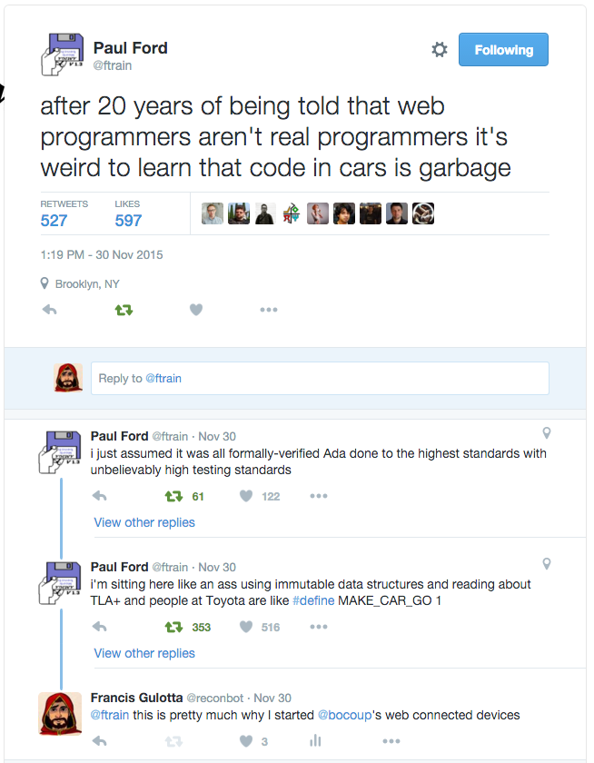
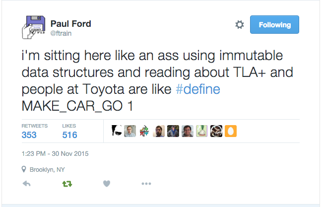
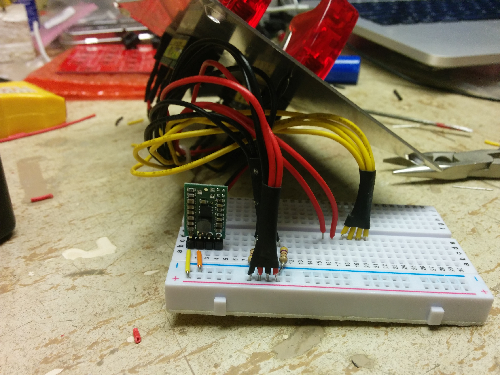
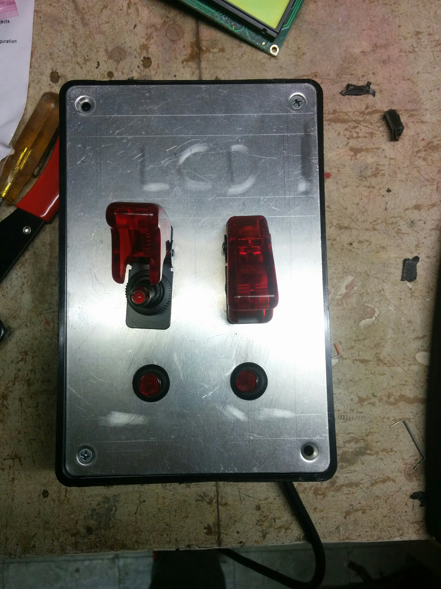
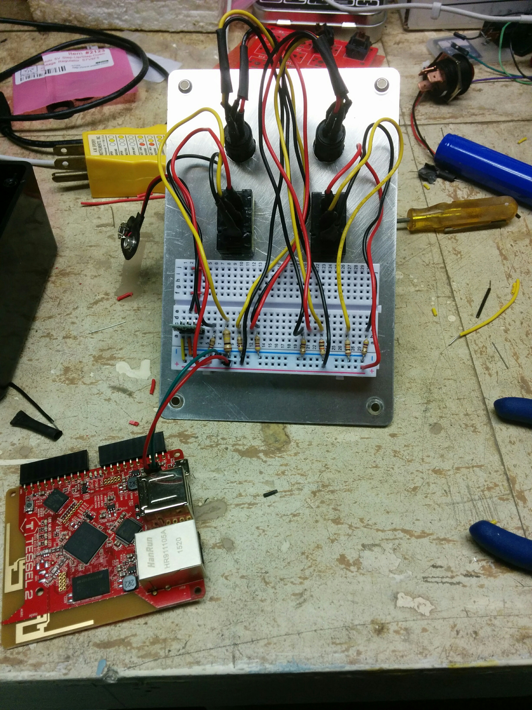
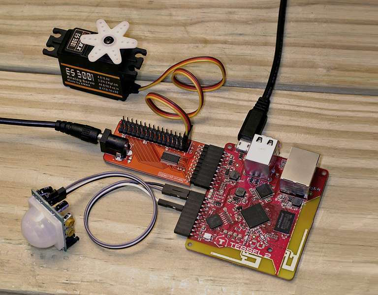

#[fit] Missile Commands

```
```

---


---

# photo of the launcher

^ how do we program this

---


^ like this

---

#[fit] Hi I'm Francis

```
```
---


#[fit] @reconbot

```
```
---


---


#[fit] Johnny-Five.io

```
```

---

> J5 makes hardware development as easy as web development
-- Probably Rick Waldron

---



---



---


---

# Hardware Preview

---





---

#[fit] Redux
```
```
---

#[fit] Redux
## The predictable state container for JavaScript apps

```
```
---
#[fit] Redux
## The *immutable* state container for JavaScript apps

```
```

---


---

Whatever

---


```
```
---
# Redux

```js
let state = { mode: 'resting' };
let action = { type: 'launch the missiles!' };
let newState = reduxMagic(state, action);
// { mode: 'launching missiles' }

```

---

```js
// React Redux Example
import React, { Component, PropTypes } from 'react'
import { connect } from 'react-redux'
import * as actionCreators from '../actions'
import Armer from './armer';

const Launcher = React.createClass({
  render(){
    const { launch, arm, disarm, status} = this.props
    return (<div>
      <h1>Launcher is {status}</h1>
      <Armer {... { status, arm, disarm }}/>
      <div>
        <button onClick={ launch }>Launch</button>
      </div>
    </div>);
  }
});

export default connect(state => state, actionCreators)(Launcher);


```
---

# Redux Demo

---
# Johnny-Five
JavaScript Robotics and IoT programming framework, developed at Bocoup.

---

# Johnny-Five
More than just a framework

---

# Johnny-Five
The Platform with APIs, JS Libraries, Philosophy, Hardware, community for robots and the IoT

```
```


---


# Johnny-Five

```js
let button = new five.Button(2);

button.on("press",   () => console.log("Button pressed") );
button.on("release", () => console.log("Button released") );
button.on("hold",    () => console.log("Button held") );

```
---
# Hold event fires after
#[fit] 1/2 Second or 500 Milliseconds

```
```
---

# 50 centiseconds

```
```
---
# Johnny-Five

```js

let flipSwitch = new five.Switch(8);
let led = new five.Led(13);

flipSwitch.on("open", () => led.off() );
flipSwitch.on("close", () => led.on() );

```

---
# Johnny-Five-Redux

```js
let actions = [
  { type: 'button:press' },
  { type: 'button:release' },
  { type: 'button:hold' }
];

```

---

# Johnny-Five Callbacks

```js
var five = require('johnny-five');
var board = new five.Board();
board.on('ready', function(){
  var armer = new five.Switch(5);
  var launch = new five.Button(6);
  var launchLight = new five.Led(7);
  var launched = true;
  armer.on('close', function(){ launchLight.on(); });
  armer.on('open', function(){
    launchLight.off()
    launched = false;
  });
  launch.on('press', function(){
    if (armer.isClosed && !launched){
      launched = true;
      launchLight.off();
    }
  });
});

```

---

```js
// dispatchEvent = ()=>{};

board.on('ready', ()=>{
  var button = new five.Button(4);
  button.on('press', () => {
    dispatchEvent({
      type: 'button:press'
    });
  })
});


.
```

---

```js
// actionify.js
export default function(device, event, name, callback) {
  device.on(event, (data) => {
    callback({
      type: `${name}:${event}`,
      payload: data
    });
  })
}

```
---

```js
import actionify from 'actionify';

// dispatchEvent = ()=>{};
var button = new five.Button(4);
actionify(button, 'press', 'launcher', dispatchEvent);

//  {
//    type: 'launcher:press'
//  }
```
---

```js
import { combineReducers } from 'redux'
export default function status(state = 'rest', action){
  switch(action.type){
    case 'armer:closed':
      return (state === 'rest') ? 'armed' : state;
    case 'armer:open':
      return 'rest';
    case 'launcher:press':
      return (state === 'armed') ? 'launched' : state;
    default:
      return state;
  }
}


.
```

---

```js
// j5-render.js
export default function render(state){
  switch(state){
    case 'rest':
      LaunchLight.off(); break;
    case 'armed':
      LaunchLight.on(); break;
    case 'launched':
      launch(); break;
  }
}


.
```

---

# DEMO TIME


---

# Tessel 2 in January

---

# NodeBots.NYC in January

---

Thanks to Polygon for the gifs
http://www.polygon.com/features/2013/8/15/4528228/missile-command-dave-theurer

Thanks to Vernimark for the inside missile command images http://www.vernimark.com/?p=1183

Thanks to Paul Ford for being angry about cars https://twitter.com/ftrain/status/671393150628438016

Thanks to Pololu for being awesome https://www.pololu.com/product/2123


